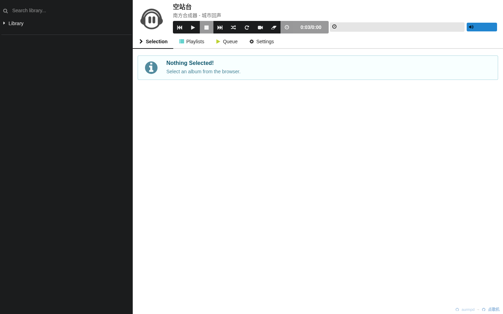
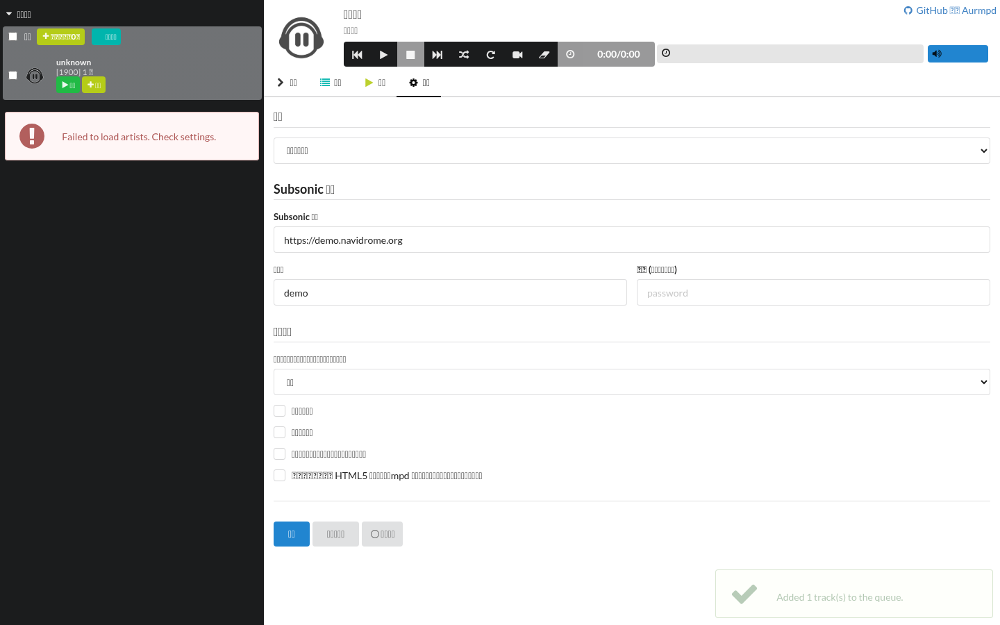
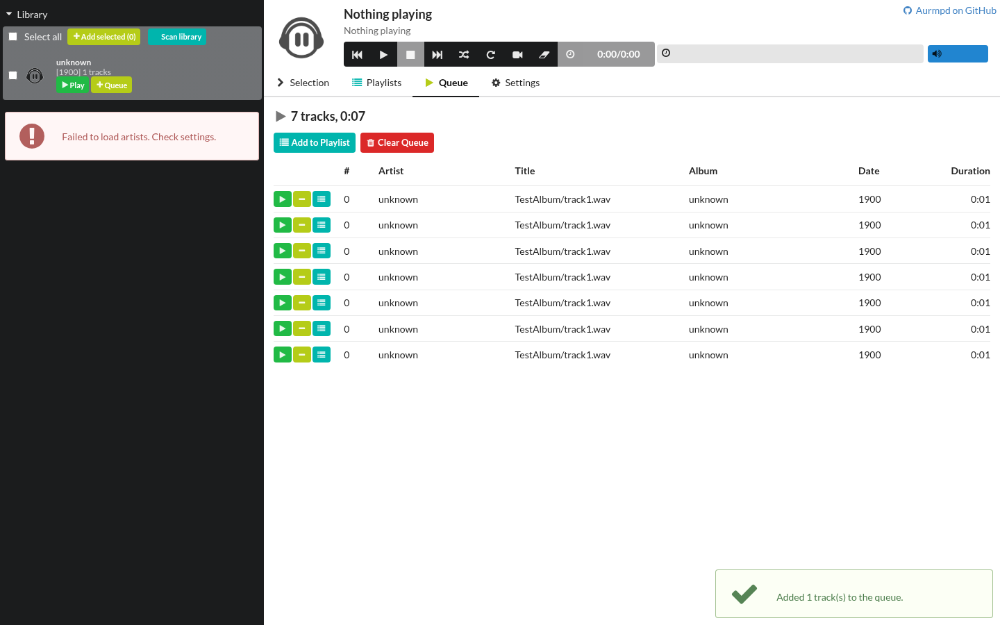

<div align="center">


# 点歌机

**局域网公共点歌机** · 本地曲库 · 多端同控 · 轻量

[](LICENSE)
[](https://github.com/DragonTTDream/aurmpd-jukebox/releases)
[](#下载)
[](#轻量适合低配设备)
[](https://github.com/breezecloud/aurmpd)

<sub>基于 [breezecloud/aurmpd](https://github.com/breezecloud/aurmpd)（GPL-2.0）修改 ｜ 上游 README 原文见 [docs/UPSTREAM-README.md](docs/UPSTREAM-README.md)</sub>

</div>

局域网内多人同时点歌的音乐播放器：**任何设备打开网页，看到的都是同一份播放队列、同一套控制**。

浏览器界面负责浏览与点歌，播放由后台的 [mpd](https://www.musicpd.org/) 负责——
关掉浏览器音乐不会停，多台设备之间状态实时同步。



## 轻量：适合低配设备

实测（x86_64 Linux，空闲状态，无播放任务）：

| 进程 | 常驻内存 (RSS) | 线程 | 空闲 CPU |
| --- | --- | --- | --- |
| `aurmpd`（HTTP/WS 服务 + 前端托管） | **约 2 MB** | 2 | ≈ 0% |
| `mpd`（曲库扫描与播放） | 约 17 MB | 3 | ≈ 0% |
| **合计** | **约 19 MB** | 5 | ≈ 0% |

- 前端是静态单页资源（约 0.9 MB），由 `aurmpd` **自身托管**，不需要额外 Web 服务器
- 没有数据库、没有常驻中间件；Windows 版就是一个可执行文件 + 一个 DLL（mpd 已内置）
- 因此可用于：**软路由 / 树莓派等 ARM 小主机 / 旧笔记本 / NAS / 迷你主机 / 旧平板**
- 曲库规模只影响 mpd 的扫描时间与硬盘占用，不影响常驻内存量级

## 下载

| 平台 | 文件 | 说明 |
| --- | --- | --- |
| **Windows x64** | `aurmpd-1.0.0-win64.zip` | **推荐**：解压即用，自带 mpd 与托盘启动器 |
| **Linux x86_64** | `aurmpd-1.0.0-linux-x86_64.tar.gz` | 需自行安装并运行 mpd |

发布页：<https://github.com/DragonTTDream/aurmpd-jukebox/releases/latest>

## 功能

### 播放与队列

- [x] 同一个 mpd 队列，**多终端共享**：谁都能暂停、切歌、点歌，状态实时同步
- [x] 队列不随浏览器关闭而丢失；aurmpd 重启后自动从 mpd 恢复
- [x] **循环 / 单曲 / 消费** 播放模式（多端状态同步）
- [x] **进度条点击或拖动跳转**（拖动只做本地预览，松手才提交一次）
- [x] 音量 / 随机 / 上一首 / 下一首；音量条支持**触摸**

### 曲库与点歌

- [x] 本地曲库按专辑浏览，**点专辑标题就地展开曲目**（无需跳页）
- [x] **关键词检索**：直接列出匹配的**曲目行**，可一键播放 / 加入队列
- [x] **批量点歌**：勾选 + 全选 + 批量加入队列
- [x] 专辑行内一键「播放全部 / 加入队列」
- [x] **曲库扫描**：新增歌曲后手动重扫（空库时自动扫描一次）

### 歌单与设置

- [x] **本地歌单**：把当前队列存成歌单 / 列出 / 查看 / 加载 / 删除（mpd 原生歌单）
- [x] 清空队列、从队列移除单曲
- [x] **中英双语**界面（设置页切换，即时生效）
- [x] Windows：**开机自启**（托盘右键 + 设置页开关，写入当前用户注册表，无需管理员权限）

### 其他

- [x] 手机端响应式布局（窄屏上下堆叠、表格内部横滚、触控目标 ≥40px）
- [x] 页面无登录鉴权，面向可信局域网（客厅、店铺等）的公共点歌场景

## 两个版本的区别

前端功能**完全相同**，差异在运行方式与系统集成：

| 能力 | Windows 版 | Linux 版 |
| --- | --- | --- |
| 内置 mpd（一键启动） | ✅ 自带 `mpd.exe` 0.23.9 + `libmpdclient-2.dll` | ❌ 需自行安装并启动 mpd |
| 启动方式 | 双击 `winaurmpd.exe`：后台运行 + 托盘图标，自动拉起 mpd 与 aurmpd | `./aurmpd`（前台运行，建议 systemd 托管） |
| 系统托盘图标 | ✅ | ❌ |
| 开机自启 | ✅ 托盘右键 + 设置页开关（写 `HKCU\...\Run`，无需管理员权限） | ❌ 设置页自动隐藏该项；请用 `systemctl enable` |
| 首次配置 | 首次运行自动生成 `mpd.conf`；`music_directory` 的反斜杠自动转正斜杠 | 自行编写 `mpd.conf`（路径用正斜杠；包内附 `mpd.conf.sample`） |
| 退出方式 | 托盘右键 → Exit（连带结束 mpd 与 aurmpd） | `Ctrl+C` / `systemctl stop` |
| 网络与播放 | `0.0.0.0:8600`，多终端共享同一队列 | 相同 |

<details>
<summary><strong>Linux：用 systemd 做开机自启</strong></summary>

```ini
# /etc/systemd/system/aurmpd.service
[Unit]
Description=aurmpd local jukebox
After=mpd.service network.target
Wants=mpd.service

[Service]
ExecStart=/opt/aurmpd/aurmpd
WorkingDirectory=/opt/aurmpd
Restart=on-failure
User=mpd

[Install]
WantedBy=multi-user.target
```

```bash
sudo systemctl daemon-reload && sudo systemctl enable --now aurmpd
```
</details>

## 快速开始

### Windows

1. 解压到**无中文、无空格**的目录（不要覆盖旧目录）；
2. 双击 `winaurmpd.exe` → 托盘出现图标，自动拉起 mpd 与 aurmpd；
3. 浏览器打开 `http://127.0.0.1:8600`（局域网用 `http://<本机IP>:8600`），首次按 **Ctrl+F5 强刷**；
4. 编辑 `mpd.conf` 的 `music_directory` 指向音乐目录，再用曲库面板的 **Scan library** 扫描。

### Linux

```bash
# 1) 安装并启动 mpd（以 Debian/Ubuntu 为例）
sudo apt install mpd libmpdclient2
# 2) 解压发布包后运行
./aurmpd          # 默认监听 0.0.0.0:8600
```

## 配置要点

| 项 | 说明 |
| --- | --- |
| `music_directory` | **绝对路径 + 正斜杠**，如 `music_directory "D:/Music"`（Windows 启动器也会自动把 `\` 转 `/`） |
| `.mpd/` 目录（Windows 包） | mpd 的数据库 / 日志 / 歌单目录，**不要删除**（缺失会导致 mpd 启动失败、曲库为空） |
| 改目录后曲库没更新 | 点曲库面板 **Scan library**；空曲库时程序会自动扫描一次 |
| 页面无鉴权 | 仅建议在**可信局域网**内使用；如需公网访问请自行加反向代理与认证 |

## 修复记录

已修复问题的完整列表（现象 / 原因 / 处理）见 **[docs/FIXES.md](docs/FIXES.md)**。

## 从源码构建

<details>
<summary><strong>后端（C/C++）</strong></summary>

```bash
cmake -B build -DCMAKE_BUILD_TYPE=Release
cmake --build build -j$(nproc)          # 产物：build/aurmpd
```

Windows 交叉编译需 mingw-w64 与 Windows 版 libmpdclient，产物为 `aurmpd.exe` 与 `winaurmpd.exe`。
</details>

<details>
<summary><strong>前端（preact + semantic-ui）</strong></summary>

```bash
cd aurial
NODE_OPTIONS=--openssl-legacy-provider npm run dist   # 产物直出 ../build/htdocs
```

> 该前端是 2017 年前后的技术栈（webpack 2 / babel 6），较新的 Node 需要 `--openssl-legacy-provider`。
</details>

## 界面

| 曲库（检索 / 批量点歌 / 扫描） | 设置（双语 / 开机自启 / 关于） |
| --- | --- |
|  |  |

| 队列 | 手机端 |
| --- | --- |
|  |  |

> 每个页面/分栏的用途、HTTP 与 WebSocket 接口清单、排错手册：**[docs/FEATURES.md](docs/FEATURES.md)**

## 来源与许可

- **上游**：[breezecloud/aurmpd](https://github.com/breezecloud/aurmpd)（GPL-2.0）—— 本项目的直接来源
- **本仓库**：[DragonTTDream/aurmpd-jukebox](https://github.com/DragonTTDream/aurmpd-jukebox)（同样 **GPL-2.0**，保留上游版权声明与 `LICENSE`）
- **致谢**：[aurial](https://github.com/shrimpza/aurial)（前端原型与图标，MIT）、[mpd](https://www.musicpd.org/) / [libmpdclient](https://www.musicpd.org/libs/libmpdclient/)（播放与控制）、[mongoose](https://mongoose.ws)（网络层）
- **图标**：`aurial/src/css/aurial_200.png` 来自 [aurial](https://github.com/shrimpza/aurial)（MIT 许可，宽松协议，可随本项目以 GPL-2.0 一起分发）；上游 aurmpd 亦沿用同一图标
